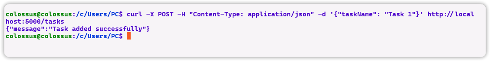

**Simple Microservices App for CKAD/CKA Certification**

This microservices architecture application is designed to help you prepare for the CKAD/CKA certification exams. It consists of:

- **UI with Go:** The UI is built using GoLang, providing a user-friendly interface.
- **Python Backend:** Python is used for the backend, handling CRUD (Create, Read, Update, Delete) operations.
- **MySQL Database:** The application uses a MySQL database named `ckad_crud` with a `tasks` table to store data.

**How to Run:**
1. Ensure you have Docker installed on your system.
2. Clone the repository containing the Docker Compose files.
3. Run the following command to build and start the application:
   ```bash
   docker-compose up -d --build
   ```
4. Once the containers are up and running, you can access the UI at `http://localhost:8080` and interact with the application.

**Benefits:**
- **Scalability:** The microservices architecture allows for easy scalability of different components independently.
- **Flexibility:** Using multiple technologies allows you to leverage the strengths of each for specific tasks.
- **Learning Opportunity:** Working with a real-world microservices architecture provides valuable hands-on experience, especially for CKAD/CKA preparation.

**Example Usage:**
You can test the backend CRUD operations using `curl` commands. For example, to add a task:

```bash
curl -X POST -H "Content-Type: application/json" -d '{"taskName": "Task 1"}' http://localhost:5000/tasks
```



**Environment Variables:**

Make sure to 

- replace the environment variables with yours:

    - `MYSQL_ROOT_PASSWORD`: Root password for MySQL.
    - `MYSQL_DATABASE`: Name of the MySQL database (`ckad_crud`).
    - `MYSQL_USER`: MySQL user (`colo`).
    - `MYSQL_PASSWORD`: MySQL password (`colo`).
    - `MYSQL_PORT`: MySQL port (`3306`).
    - `MYSQL_HOST`: MySQL host (`mysql`).

- add an .env file to hold environment variables.

Feel free to explore and modify the application as needed for your certification preparation!

Happy coding!