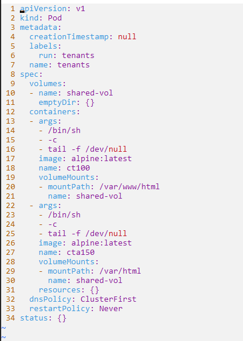
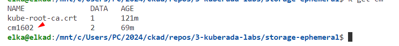
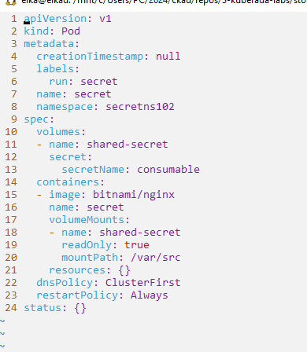
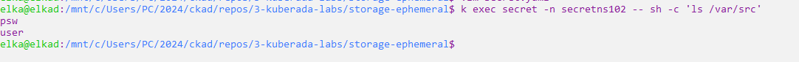

# Ephemeral Storage: A Hands-On Guide with emptyDir, ConfigMap, and Secret in Kubernetes Lab Guide

This guide corresponds to the hands-on section of the blog article with the same title. Read the blog article and proceed by following the instructions provided [here]().

## emptydir scenario

**Step-1** Create the cluster or use a public/paid playground.


**Step-2**  Create the pod manifest file running the following command:

```sh
k run tenants --image=alpine:latest --dry-run=client -oyaml --restart=Never -- /bin/sh -c 'tail -f /dev/null' > tenants.yaml
```


**Step-3** Edit the requirements in the file:

Open kubernetes docs and see the relevant [emptyDir configuration example](https://kubernetes.io/docs/concepts/storage/volumes/).


```sh
vim tenants.yaml
k apply -f tenants.yaml
``````



Describe the pods to verify that they're running endlessly and have a shared volume mounted.

```sh
k describe po tenants
```

**Step-4** Verify the file exchange between containers.

```sh
k exec tenants -c ct100 -- sh -c "touch /var/www/html/index.html"
k exec tenants -c cta150 -- sh -c "ls /var/html/index.html"
```


## configmap scenario

**Step-1**  Create the configmap running the following command:

```sh
k create cm cm1602 --from-literal=app=frontend --from-literal=team=dev02
```



**Step-2**  Create the pod manifest file running the following command:

```sh
k run consumer --image=bitnami/nginx --dry-run=client -oyaml > consumer.yaml
```

**Step-3** Edit the requirements in the file:

Open kubernetes docs and see the relevant [Populate a Volume with data stored in a ConfigMap](https://kubernetes.io/docs/tasks/configure-pod-container/configure-pod-configmap/#populate-a-volume-with-data-stored-in-a-configmap).

```sh
vim consumer.yaml
k apply -f consumer.yaml
```


**Step-4** Display the  contents on the `/var/src` directory.

```sh
k exec consumer -- sh -c "ls /var/src"
```


### secret scenario


**Step-1**  Create the secret running the following command:

```sh
k create ns secretns102
k create secret generic consumable -n secretns102 --from-literal=user='admin' --from-literal=psw='admin'
```

**Step-2**  Create the pod manifest file running the following command:

```sh
k run secret --image=bitnami/nginx -n secretns102 --dry-run=client -oyaml > secret.yaml
```

**Step-3** Edit the requirements in the file:

Open kubernetes docs and see the relevant [Example: Provide prod/test credentials to Pods using Secrets](https://kubernetes.io/docs/tasks/inject-data-application/distribute-credentials-secure/#provide-prod-test-creds).

```sh
vim secret.yaml
k apply -f secret.yaml
```





**Step-4** Display the  contents on the `/var/src` directory.

```sh
k exec secret -n secretns102 -- sh -c 'ls /var/src'
```





Congratulations!
